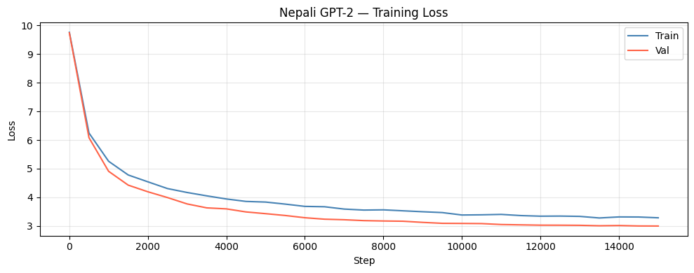

# NepaliGPT

A GPT-2 style causal language model trained from scratch on Nepali text.  
Trained on **~41 million tokens** from Nepali Wikipedia + OSCAR web corpus.

---

## Results

| Metric | Value |
|---|---|
| Final val loss | **2.9960** |
| Perplexity | **14.47** |
| Model size | **33.66 M parameters** |
| Training time | ~113 min on Tesla T4 |
| Steps | 15,000 |

### Training curve




### Sample outputs

| Prompt | Generated text |
|---|---|
| `नेपाल एक सुन्दर` | नेपाल एक सुन्दर देश हो। यहाँ मुख्यतया धान, गहुँ, उखु, आलु, तोरी... |
| `हाम्रो देशको इतिहास` | हाम्रो देशको इतिहास, संस्कृति, संस्कार र रीतिरिवाज संस्कृतिलाई संरक्षण... |
| `हिमालयको फेदीमा` | हिमालयको फेदीमा रहेको हिमालयको फेदीमा पर्ने एक प्रमुख नदी हो। |

---

## Repository structure

```
nepali-gpt2/
├── nepali_gpt2/
│   ├── __init__.py      # Public API
│   ├── model.py         # NepaliGPT architecture
│   ├── data_prep.py     # Download, tokenize, and cache corpus
│   ├── train.py         # Full training loop
│   └── generate.py      # Text generation & evaluation
├── requirements.txt
├── .gitignore
└── README.md
```

---

## Quick start

### 1 — Install dependencies

```bash
pip install -r requirements.txt
```

A CUDA-capable GPU is strongly recommended (tested on Tesla T4, 15.6 GB VRAM).

### 2 — Set up API credentials

**HuggingFace** (for Wikipedia download):
```bash
export HF_TOKEN=hf_...          # or add it in Colab Secrets
```

**Kaggle** (for OSCAR corpus download):
```bash
export KAGGLE_USERNAME=your_username
export KAGGLE_KEY=your_api_key
```

### 3 — Prepare data

```bash
python nepali_gpt2/data_prep.py
```

This will:
1. Download Nepali Wikipedia (~200k articles) from HuggingFace
2. Download the OSCAR Nepali corpus (~500k lines) from Kaggle
3. Merge both into `data/nepali_corpus.txt`
4. Train a 16k-vocab SentencePiece BPE tokenizer
5. Tokenize and cache all tokens as `data/tokens.npy` (~164 MB)

### 4 — Train

```bash
# Default (base model, 15k steps)
python nepali_gpt2/train.py

# Custom settings
python nepali_gpt2/train.py --max_steps 50000 --batch_size 64 --model_size base
```

Checkpoints are saved in `ckpt/`:
- `ckpt/best.pt` — best validation loss so far
- `ckpt/step_005000.pt` — periodic crash-recovery saves (every 5,000 steps)

### 5 — Generate text

```bash
# Text generation (default)
python nepali_gpt2/generate.py --prompt "नेपाल एक सुन्दर"

# Next-word prediction
python nepali_gpt2/generate.py --mode next_words --prompt "काठमाडौं"

# Evaluate perplexity on the validation set
python nepali_gpt2/generate.py --mode eval
```

### Python API

```python
from nepali_gpt2 import load_model_and_tokenizer, generate, next_words

model, sp, cfg, device = load_model_and_tokenizer(
    ckpt_path="ckpt/best.pt",
    tok_path="tokenizer/nepali_bpe.model",
)

# Generate text
text = generate(model, sp, cfg, device,
                prompt="नेपाल एक सुन्दर",
                max_new=80, temperature=0.8, top_k=50, top_p=0.92)
print(text)

# Next-word probabilities
preds = next_words(model, sp, cfg, device, prompt="काठमाडौं", top_n=5)
for word, prob in preds:
    print(f"{word:15s} {prob:.3f}")
```

---

## Model architecture

NepaliGPT is a decoder-only transformer (GPT-2 style):

| Component | Detail |
|---|---|
| Embedding | Token + positional (`context_length = 512`) |
| Attention | Multi-head causal self-attention |
| FFN | 2-layer MLP with GELU, expansion factor 4× |
| Normalization | Pre-LayerNorm (before attention & FFN) |
| Weight tying | Embedding matrix shared with output projection |
| Initialisation | Normal(0, 0.02) for weights, zeros for biases |

### Available model sizes

| Size | `emb_dim` | `n_heads` | `n_layers` | Params | Hardware |
|---|---|---|---|---|---|
| `small` | 384 | 6 | 6 | ~17 M | Any GPU |
| `base` *(default)* | 512 | 8 | 8 | ~34 M | T4 (16 GB) |
| `large` | 768 | 12 | 12 | ~117 M | A100 (40 GB) |

---

## Training details

| Hyper-parameter | Value |
|---|---|
| Optimizer | AdamW (`β₁=0.9`, `β₂=0.95`) |
| Peak LR | 5 × 10⁻⁴ |
| LR schedule | Linear warm-up (500 steps) → cosine decay to 10% |
| Weight decay | 0.1 (2D params only) |
| Gradient clip | 1.0 |
| Batch size | 32 |
| Precision | Mixed (fp16 via `torch.amp`) |
| Corpus | Wikipedia (200k articles) + OSCAR (500k lines) |
| Tokenizer | SentencePiece BPE, vocab = 16,000 |

---

## Data sources

| Source | Size | License |
|---|---|---|
| [Nepali Wikipedia](https://huggingface.co/datasets/wikimedia/wikipedia) | ~200k articles | CC BY-SA 4.0 |
| [OSCAR Nepali](https://www.kaggle.com/datasets/hsebarp/oscar-corpus-nepali) | ~500k lines | CC0 / research use |

---

## Limitations

- The model was trained for only 15,000 steps (~1 epoch on this corpus). Longer training will improve quality.
- Output can be repetitive — a higher temperature or more epochs helps.
- The model has no instruction-following capability; it is a raw language model.
- Generated text may contain factual errors.

---

## License

MIT
