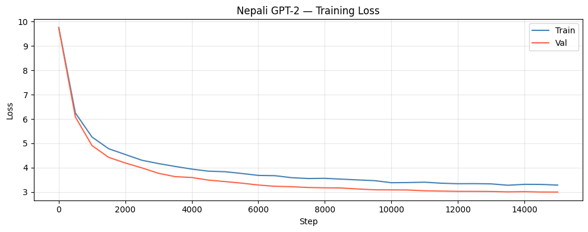

# NepaliGPT

> A GPT-2 style causal language model trained from scratch on **~41 million tokens** of Nepali text.

**About this project** — NepaliGPT is an end-to-end, reproducible Nepali
language model: it downloads the corpus, trains its own Devanagari-aware
SentencePiece tokenizer, trains a decoder-only transformer and serves it
through a small Python API + CLI. No pretrained checkpoints, no transfer
learning — everything from corpus to checkpoint is built by this repo.

NepaliGPT is a **decoder-only transformer** built and trained entirely from scratch — no pretrained checkpoints, no transfer learning. It learns to model Nepali text one token at a time and can generate coherent Nepali text, predict likely next words, and be measured with perplexity for downstream generative NLP tasks.

---

## About

Nepali is a low-resource language: it is spoken by ~30 million people, yet
most mainstream language models give it little attention, and pretrained
weights for Nepali are scarce and expensive to serve. NepaliGPT addresses
that gap by building a capable, standalone Nepali language model from
**zero external pretrained weights** — everything from the corpus to the
checkpoint is produced by this repository.

**What it does**

- **Generates Nepali text** from a short prompt (कविता, समाचार, निबन्ध शैली…)
- **Predicts next words** with probabilities, useful for keyboards, completion, suggestions
- **Learns character/word structure** from a 16k-vocabulary SentencePiece BPE subword tokenizer
- **Turns out a compact, reproducible model** you can retrain on any Nepali corpus

**Why a custom tokenizer?** Standard subword tokenizers are trained on
English and mangle Devanagari script. NepaliGPT trains its own BPE
tokenizer on Nepali Wikipedia + web text, so `नेपाल`, `हिमालय`,
`संस्कृति` and friends become natural subword units instead of broken
pieces — the single most important pre-processing choice for Devanagari
NLP.

**The project is deliberately end-to-end**: it downloads the corpus, trains
its own tokenizer, trains the model, and serves it through a small Python
API and CLI — everything is reproducible from a blank machine.

### Goals

1. Provide a small, self-contained Nepali language model anyone can run on a single GPU.
2. Be fully reproducible — corpus → tokenizer → training → inference, all in one pipeline.
3. Serve as a foundation for experiments (fine-tuning, prompting, evaluation) in Nepali NLP.

---

## Features

- **Three model sizes** — `small` (~17 M), `base` (~34 M, default), `large` (~118 M)
- **Hand-rolled GPT-2 architecture** — pre-LayerNorm, GELU, causal self-attention, weight tying
- **Mixed-precision training** with warm-up + cosine LR schedule and gradient clipping
- **Native SentencePiece BPE tokenizer** trained on Nepali (vocab 16k)
- **CLI + Python API** for generation, next-word prediction, and perplexity evaluation
- **Checkpointing** — best-loss model plus periodic crash-recovery saves
- **No pretrained-dependency downloads** — the checkpoint builds and stores everything itself

---

## Results

| Metric | Value |
|---|---|
| Final val loss | **2.9960** |
| Perplexity | **14.47** |
| Model size | **33.66 M parameters** |
| Training time | ~113 min on Tesla T4 |
| Steps | 15,000 |

### Training curve



### Sample outputs

| Prompt | Generated text |
|---|---|
| `नेपाल एक सुन्दर` | नेपाल एक सुन्दर देश हो। यहाँ मुख्यतया धान, गहुँ, उखु, आलु, तोरी... |
| `हाम्रो देशको इतिहास` | हाम्रो देशको इतिहास, संस्कृति, संस्कार र रीतिरिवाज संस्कृतिलाई संरक्षण... |
| `हिमालयको फेदीमा` | हिमालयको फेदीमा रहेको हिमालयको फेदीमा पर्ने एक प्रमुख नदी हो। |

---

## Repository structure

```
nepali-gpt2/
├── src/nepali_gpt2/            # Core Python package (src layout)
│   ├── __init__.py             # Public API + version
│   ├── __main__.py             # `python -m nepali_gpt2` CLI dispatcher
│   ├── config.py               # Model sizes + training defaults
│   ├── model.py                # NepaliGPT architecture
│   ├── train.py                # Training CLI
│   ├── generate.py             # Generation / eval CLI
│   └── data/                   # Data pipeline subpackage
│       ├── __init__.py         # Re-exports for train/generate
│       ├── prep.py             # Corpus download + tokenizer CLI
│       └── dataset.py          # TokenDataset + eval/perplexity helpers
├── tests/                      # Smoke tests (pytest)
├── assets/                     # Images (training curves, etc.)
├── pyproject.toml              # Package metadata + editable install
├── requirements.txt
├── .gitignore
└── README.md
```

---

## Quick start

> A CUDA-capable GPU is strongly recommended (tested on Tesla T4, 15.6 GB VRAM).

### 1 — Install dependencies

```bash
pip install -r requirements.txt
# or, for an editable install:
pip install -e .
```

### 2 — Set up API credentials

**HuggingFace** (Wikipedia download):

```bash
export HF_TOKEN=hf_...          # or add it in Colab Secrets
```

**Kaggle** (OSCAR corpus download):

```bash
export KAGGLE_USERNAME=your_username
export KAGGLE_KEY=your_api_key
```

### 3 — Prepare data

```bash
python -m nepali_gpt2 data-prep    # download corpus + train tokenizer
```

This will:

1. Download Nepali Wikipedia (~200k articles) from HuggingFace
2. Download the OSCAR Nepali corpus (~500k lines) from Kaggle
3. Merge both into `data/nepali_corpus.txt`
4. Train a 16k-vocab SentencePiece BPE tokenizer
5. Tokenize and cache all tokens as `data/tokens.npy` (~164 MB)

### 4 — Train

```bash
# Default (base model, 15k steps)
python -m nepali_gpt2 train

# Custom settings
python -m nepali_gpt2 train --model-size small --max-steps 50000 --batch-size 64
```

Checkpoints are saved in `ckpt/`:

- `ckpt/best.pt` — best validation loss so far
- `ckpt/step_005000.pt` — periodic crash-recovery saves (every 5,000 steps)

### 5 — Generate text

```bash
# Text generation (default)
python -m nepali_gpt2 generate --prompt "नेपाल एक सुन्दर"

# Next-word prediction
python -m nepali_gpt2 generate --mode next_words --prompt "काठमाडौं" --top-n 5

# Evaluate perplexity on the validation set
python -m nepali_gpt2 generate --mode eval
```

---

## Python API

```python
from nepali_gpt2 import load_model_and_tokenizer, generate, next_words

model, sp, cfg, device = load_model_and_tokenizer(
    ckpt_path="ckpt/best.pt",
    tok_path="tokenizer/nepali_bpe.model",
)

# Generate text
text = generate(model, sp, cfg, device,
                prompt="नेपाल एक सुन्दर",
                max_new=80, temperature=0.8, top_k=50, top_p=0.92)
print(text)

# Next-word probabilities
preds = next_words(model, sp, cfg, device, prompt="काठमाडौं", top_n=5)
for word, prob in preds:
    print(f"{word:15s} {prob:.3f}")
```

---

## Model architecture

NepaliGPT is a decoder-only transformer (GPT-2 style):

| Component | Detail |
|---|---|
| Embedding | Token + positional (`context_length = 512`) |
| Attention | Multi-head causal self-attention |
| FFN | 2-layer MLP with GELU, expansion factor 4× |
| Normalization | Pre-LayerNorm (before attention & FFN) |
| Weight tying | Embedding matrix shared with output projection |
| Initialisation | Normal(0, 0.02) for weights, zeros for biases |

### Available model sizes

| Size | `emb_dim` | `n_heads` | `n_layers` | Params | Hardware |
|---|---|---|---|---|---|
| `small` | 384 | 6 | 6 | ~17 M | Any GPU |
| `base` *(default)* | 512 | 8 | 8 | ~34 M | T4 (16 GB) |
| `large` | 768 | 12 | 12 | ~118 M | A100 (40 GB) |

---

## Training details

| Hyper-parameter | Value |
|---|---|
| Optimizer | AdamW (`β₁=0.9`, `β₂=0.95`) |
| Peak LR | 5 × 10⁻⁴ |
| LR schedule | Linear warm-up (500 steps) → cosine decay to 10% |
| Weight decay | 0.1 (2D params only) |
| Gradient clip | 1.0 |
| Batch size | 32 |
| Precision | Mixed (fp16 via `torch.amp`) |
| Corpus | Wikipedia (200k articles) + OSCAR (500k lines) |
| Tokenizer | SentencePiece BPE, vocab = 16,000 |

---

## Data sources

| Source | Size | License |
|---|---|---|
| [Nepali Wikipedia](https://huggingface.co/datasets/wikimedia/wikipedia) | ~200k articles | CC BY-SA 4.0 |
| [OSCAR Nepali](https://www.kaggle.com/datasets/hsebarp/oscar-corpus-nepali) | ~500k lines | CC0 / research use |

---

## Testing

```bash
pip install pytest
pytest            # runs tests/test_model.py (requires torch)
```

---

## Limitations

- The model was trained for only 15,000 steps (~1 epoch on this corpus). Longer training will improve quality.
- Output can be repetitive — a higher temperature or more epochs helps.
- The model has no instruction-following capability; it is a raw language model.
- Generated text may contain factual errors.

---

## Contributing

Issues, pull requests and Nepali-language datasets are all welcome. If you extend the corpus or tune the training run, open a PR with the new results table.

---

## License

MIT — see [LICENSE](LICENSE).